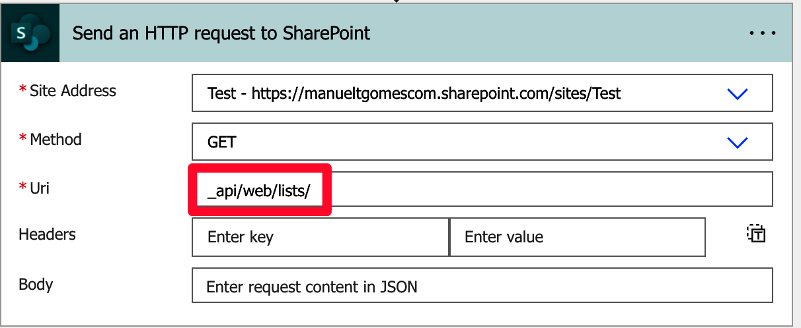
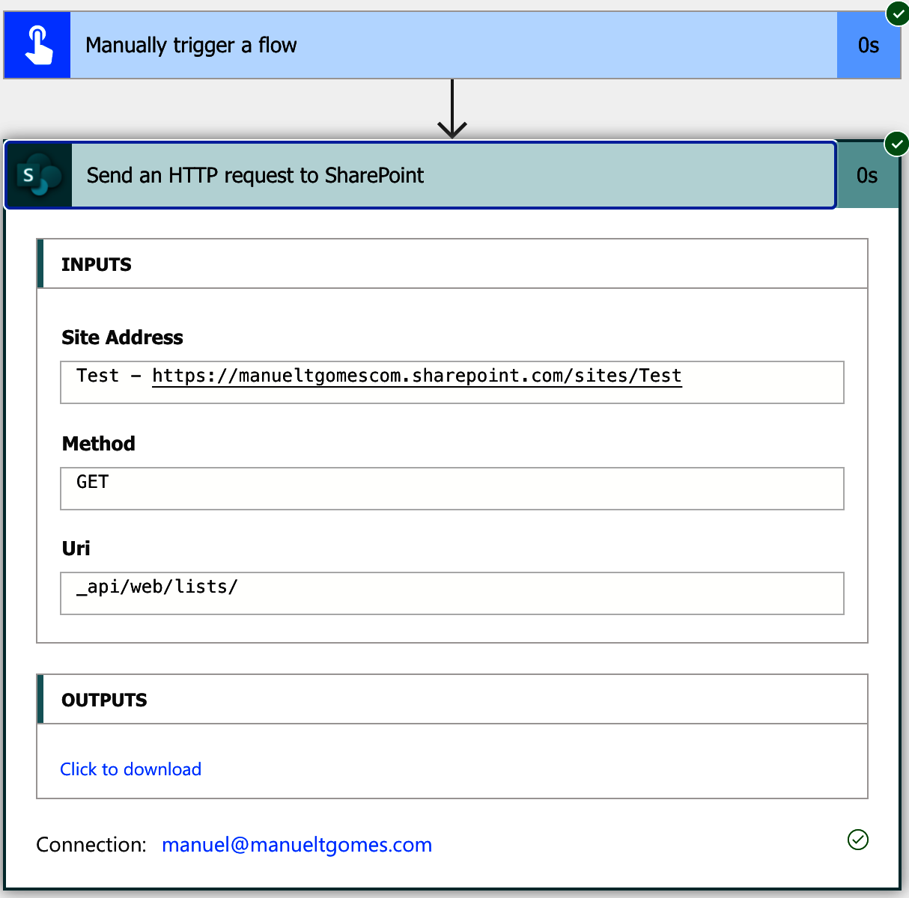
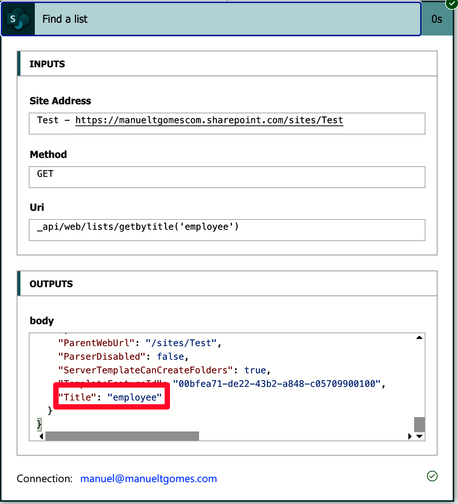

<h1 align="center">
  Power Automate SharePoint HTTP Request Cookbook
</h1>
<h5 align="center">(in the making)</h5>

<p align="center">
<a href="https://github.com/ManuelTGomes/power-automate-sharepoint-http-request-cookbook/blob/main/LICENSE" target="blank">

</a>
<a href="https://github.com/ManuelTGomes/power-automate-sharepoint-http-request-cookbook/fork" target="blank">

</a>
<a href="https://github.com/ManuelTGomes/power-automate-sharepoint-http-request-cookbook/stargazers" target="blank">

</a>
<a href="https://github.com/ManuelTGomes/power-automate-sharepoint-http-request-cookbook/issues" target="blank">

</a>
<a href="https://github.com/ManuelTGomes/power-automate-sharepoint-http-request-cookbook/pulls" target="blank">

</a>
</p>

<p align="center">
    ·
    <a href="https://github.com/ManuelTGomes/power-automate-sharepoint-http-request-cookbook/issues/new/choose">Report Bug</a>
    ·
    <a href="https://github.com/ManuelTGomes/power-automate-sharepoint-http-request-cookbook/issues/new/choose">Request Feature</a>
    ·
    <a href="https://github.com/ManuelTGomes/power-automate-sharepoint-http-request-cookbook/issues/new/choose">Submit Expression</a>
    ·
</p>

---

## What are you looking for?

Here are the sections that we have so far:

- [Introduction](#introduction)
  - [Concepts](#concepts)
    - [What is an endpoint?](#what-is-an-endpoint)
    - [What is JSON?](#what-is-json)
  - [What are you looking for?](#what-are-you-looking-for)
  - [Lists](#lists)
    - [Get all lists for a SharePoint site](#get-all-lists-for-a-sharepoint-site)
    - [Find a list](#find-a-list)
    - [Get the columns for a list](#get-the-columns-for-a-list)
  - [🙏 Thanks to](#-thanks-to)
  - [💪 Contributing](#-contributing)

---

## Introduction

I'm compiling a list of all SharePoint endpoints that I find helpful, and I think you may too. I'm focusing on Power Automate, but you can use them with other tools.
If you have any questions on how to use them, please go to [Power Automate: Get dynamic information from SharePoint](https://tgom.es/ymar6), where I do my best to explain the concepts and provide examples.

---

## Concepts

Here are some essential things to understand before going forward.

### What is an endpoint?

It's a good question :). Of course, I'm going to oversimplify since this reference isn't intended for CS majors but for everyone that wants to automate their tasks using Power Automate. Still, an endpoint is something that facilitates the communication between two entities.

We're using SharePoint (the first entity), where we want to fetch data using Power Automate (the second entity). Power Automate will use an URL (the "endpoint") to bring the information.

In our case, the endpoints are URLs with a structure that return information, so we can't change them. When we "ask" something (send a request using the ["Power Automate: Send an HTTP request to SharePoint Action"](https://manueltgomes.com/reference/power-automate-action-reference/send-an-http-request-to-sharepoint-action/)) we get information from SharePoint in JSON format (see next section).

Since Power Automate provides the [“Power Automate: Send an HTTP request to SharePoint Action”](https://manueltgomes.com/reference/power-automate-action-reference/send-an-http-request-to-sharepoint-action/) some of the complexity is hidden, so we consider the endpoint as everything that comes after "https://\<your site\>.sharepoint.com/", like:



Behind the scenes, the request will be sent to SharePoint like this, for example:

```
https://manueltgomescom.sharepoint.com/sites/Test/_api/web/lists/
```

Again, I'm oversimplifying this but what's important is that you understand the overall concept.

[Back to the index](#what-are-you-looking-for)

### What is JSON?

It's a pretty broad question, and there are millions of pages, videos, and other resources explaining what it is. I won't replicate them here, but it would be helpful to understand at least the fundamentals to take full advantage of the information provided by the endpoints.

[Back to the index](#what-are-you-looking-for)

---

## Lists

Here you can find some endpoints related to lists.

### Get all lists for a SharePoint site

The endpoint is quite simple.


```
_api/web/lists/
```

You'll get something like this:



[Back to the index](#what-are-you-looking-for)

### Find a list

If you don't know the ID of the list, you can still find it by name:



```
\_api/web/lists/getbytitle('employee')

```

Please note that we're searching for **one** list with that name. If the list doesn't exist, the Flow will fail. So please be sure that the list exists or that you deal with [errors accordigly](https://manueltgomes.com/microsoft/powerautomate/plan-for-errors-and-timeouts/).

[Back to the index](#what-are-you-looking-for)

### Get the columns for a list


```
_api/web/lists/getbytitle('employee')/Fields
```

[Back to the index](#what-are-you-looking-for)

---

## 🙏 Thanks to

Thanks to everyone that reached out. If you submit anything, you'll get your name here :).

[Back to the index](#what-are-you-looking-for)

---

## 💪 Contributing

Submissions are always welcome, so please <a href="https://github.com/ManuelTGomes/power-automate-sharepoint-http-request-cookbook/issues/new/choose">Submit a new recipe</a>. I'll check it, but please accompany it always with a bit of explanation so that people know how to use it and what kind of information we're looking for.

<hr>
<p align="center">
Made in ☀️ Portugal with ❤️
</p>
